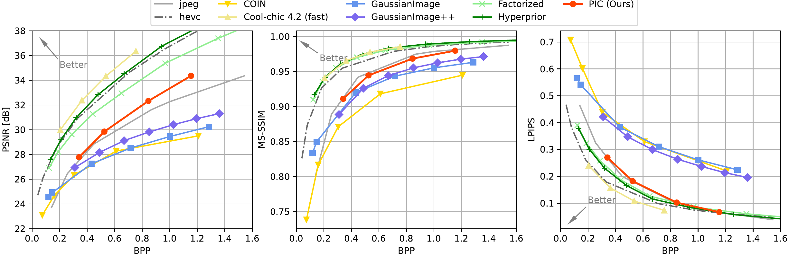
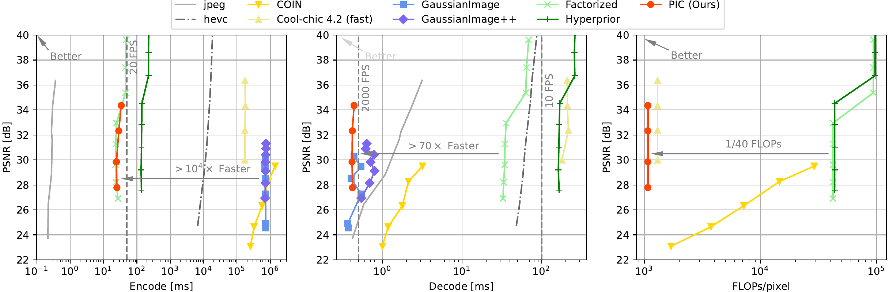
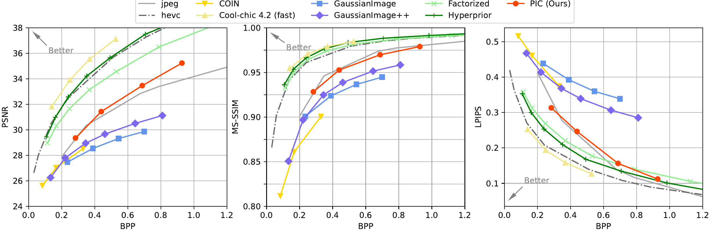
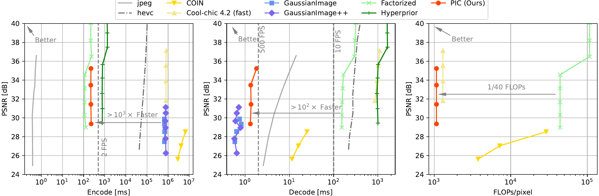
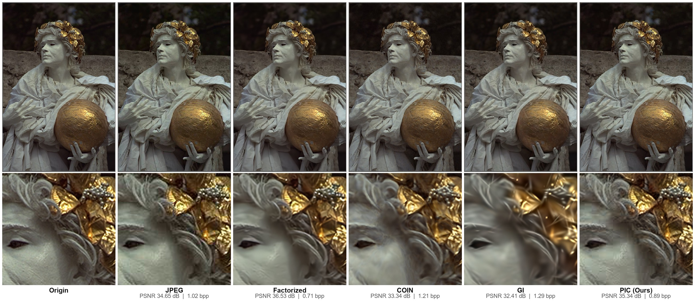
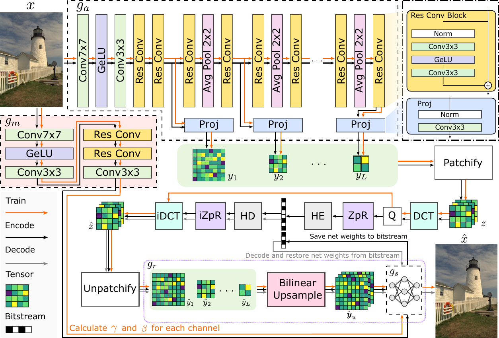
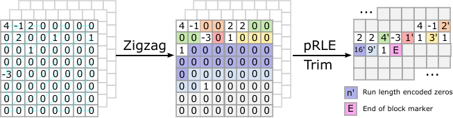

<div align="center">

# PIC: Revisiting INR for Image Coding with Fast Encoding and Sub-Millisecond Decoding

**ECCV 2026**

Xiang Liu<sup>1,3</sup>\*, Jinxiang Wang<sup>1</sup>\*, Bin Chen<sup>2</sup>†, Zimo Liu<sup>3</sup>, Mingyao Hong<sup>3</sup>,
Jiawei Li<sup>4</sup>, Yaowei Wang<sup>2,3</sup>, Shu-tao Xia<sup>1,3</sup>

<sup>1</sup> Tsinghua University &nbsp;·&nbsp; <sup>2</sup> Harbin Institute of Technology, Shenzhen &nbsp;·&nbsp;
<sup>3</sup> Peng Cheng Laboratory &nbsp;·&nbsp; <sup>4</sup> Joy Future Academy, JD Group

<sub>\* Equal contribution. &nbsp; † Corresponding author.</sub>

[](https://arxiv.org/abs/2609.09020)
[](LICENSE)

Official PyTorch implementation — [**Paper**](https://arxiv.org/abs/2609.09020) · [**Checkpoints**](ckpts)

</div>

---

## TL;DR

**PIC** is a *feed-forward* INR image codec. Instead of overfitting a neural representation to every
image at encode time, a single forward pass of an end-to-end trained network **generates the whole
low-bit-rate neural representation** — latents *and* the instance-dependent network weights.

The result is a codec that is fast on **both** ends:

| | Encoding | Decoding | RD (BD-Rate vs. JPEG, Kodak) |
|---|---|---|---|
| **PIC (Ours)** | **28.6 ms** (≈20 FPS) | **0.418 ms** (>2000 FPS) | **−12.78 %** |

To our knowledge, this is the first learning-based codec that matches or beats JPEG in **both**
rate-distortion performance and decoding speed while keeping encoding practical.

### How it compares to other paradigms

| Model | Paradigm | Feed-forward | BD-Rate ↓ | Enc. [ms] ↓ | Dec. [ms] ↓ | FLOPs / pixel ↓ |
|---|---|:---:|---|---|---|---|
| Factorized | E2E | ✓ | −47.34 % | **24.3** | 35.7 | 42.175 K |
| Hyperprior | E2E | ✓ | −57.58 % | 141 | 169 | 45.546 K |
| COIN | Representation | | +25.53 % | 1.40 × 10⁶ | 3.18 | 29.057 K |
| Cool-Chic v4.2 (fast) | Representation | | −64.86 % | 1.77 × 10⁵ | 216 | 1.303 K |
| GaussianImage | Representation | | +36.55 % | 6.99 × 10⁵ | 0.439 | — |
| **PIC (Ours)** | E2E + Representation | **✓** | −12.78 % | **28.6** | **0.418** | **1.074 K** |

*BD-Rate is computed relative to JPEG on Kodak; all other numbers are representative values from the same experiment.*

---

## Results

### Rate-distortion on Kodak



PIC surpasses JPEG in PSNR at high bit-rate while staying comparable in MS-SSIM and LPIPS, and
clearly outperforms other representation-based methods in the same decoding-speed class.

### Speed and complexity



Encoding is on par with the lightweight Factorized model, while decoding beats every baseline
except GaussianImage — and PIC's encoding is **over three orders of magnitude faster** than other
representation-based codecs.

<details>
<summary><b>CLIC dataset results</b> (click to expand)</summary>

<br>





</details>

### Qualitative comparison



JPEG and PIC share a similar DCT-based entropy modelling and therefore similar texture rendering;
Factorized over-smooths, COIN shows swirling artifacts, and GaussianImage produces speckled
artifacts.

---

## Method



*Overall data flow:
$g_a \rightarrow \hat{\mathbf{y}} \rightarrow z \rightarrow \hat{z} \rightarrow g_r \rightarrow g_s$.
$g_a$ and $g_m$ are the latent encoder and the modulation net; HE/HD are the Huffman
encoder/decoder.*

1. **Latent encoder $g_a$.** A conv / residual-conv pyramid with average-pooling downsampling
   produces $L = 8$ multi-resolution latents
   $\hat{\mathbf{y}} = \{y_1, y_2, \dots, y_L\}$, where each
   $y_i \in \mathbb{R}^{H_i \times W_i}$.
2. **DCT + ZpR + Huffman.** Latents are patchified into $8 \times 8$ blocks, concatenated as $z$,
   DCT-transformed and quantized. The **ZpR** module then compacts the symbols before a per-image
   Huffman table (itself RLE-compressed) codes them.

   

   *ZpR = **Z**igzag reorder → trim trailing zeros → **p**artial **R**un-**L**ength **E**ncoding.*
3. **Non-autoregressive entropy model.** 64 independent piecewise-linear models — one per DCT
   frequency — are trained with a uniform-noise relaxation. Having **no ARM** is what makes
   $\mathcal{O}(1)$-per-symbol decoding possible.
4. **Weights generated by modulation.** $g_m$ predicts per-channel $\gamma$ and $\beta$; instance
   normalization and modulation are algebraically **fused into the weights of
   $\mathrm{MLP}^i$** at encode time, so the decoder only ever needs plain MLP weights.
5. **Tensor-Core-friendly decoder.** $g_s$ is a 4-layer width-16 MLP, exactly matching the
   $16 \times 16$ TF32 warp MMA shape of Tensor Cores. ZpR, DCT and the Huffman codec (adapted
   from GPUHD) plus the MLP are CUDA kernels; bitstream I/O is C++. Training uses the
   differentiable shading language **Slang** so that training numerics stay consistent with TF32
   inference.

**Objective.** Everything is trained end-to-end with a rate–distortion loss,

$$
\mathcal{L} = \lambda \, \mathcal{L}_{\mathrm{entropy}} + D(x, \hat{x}),
$$

where the rate term models each of the 64 DCT components independently,

$$
\mathcal{L}_{\mathrm{entropy}}
= -\sum_{i=1}^{n} \sum_{k=0}^{63} \log_2 p_{\theta_k}\!\left(s_{i,k} + u\right),
\qquad u \sim \mathcal{U}\!\left(-\tfrac{1}{2}, \tfrac{1}{2}\right).
$$

**Training setup.** LSDIR (84,991 images), random $512 \times 512$ crops, batch size 16, Adam with
lr $10^{-4}$, 10 epochs, MSE distortion,
$\lambda \in \{0.01,\, 0.005,\, 0.002,\, 0.001\}$. All experiments on a single RTX 4090D.

---

## Installation

```bash
conda create -n pic python=3.12 -y
conda activate pic

# PyTorch (match your CUDA version)
pip install torch torchvision --index-url https://download.pytorch.org/whl/cu121

pip install "compressai==1.2.6" einops loguru simple_parsing pytorch-msssim lpips \
            scikit-image matplotlib numba tqdm swanlab slangtorch
```

A CUDA toolkit with `nvcc` on `PATH` is required — the `csrc/pic_codec` extension and the Slang
kernel are compiled on first use (a few minutes).

> [!IMPORTANT]
> **`compressai` version matters.** The released checkpoints store the entropy bottleneck as
> `_matrixN / _biasN / _factorN`. `1.2.6` is the last release using those names; `1.2.7+` renamed
> them to `matrices.N / biases.N / factors.N`, so `load_state_dict` will report missing/unexpected
> keys. Install `1.2.6`, or keep the newer release and remap those keys when loading.

---

## Usage

All entries live under `src/` and are configured with
[`simple_parsing`](https://github.com/lebrice/SimpleParsing); run them from inside `src/`.

### Evaluation (encode → bitstream → decode → metrics)

```bash
cd src

python eval.py \
  --train_data_dir /path/to/kodak \
  --valid_data_dir  /path/to/kodak \
  --checkpoint      ../ckpts/v3_b16_c512_lmbda0.005_s16_n8.pth \
  --output_dir      ../output/eval_kodak
```

The run reports mean PSNR / MS-SSIM / LPIPS / BPP over the folder and writes
`output_eval.log` into `--pipeline.output_dir`.

- `--train_data_dir` is required by the config even though evaluation only reads
  `valid_data_dir`.
- Checkpoint names encode their setting — `..._lmbda0.005_s16_n8.pth` means `q_scale=16`,
  `n_latent=8`. These match the defaults in `configurations.py`.
- Kodak images are $768 \times 512$; with $L = 8$ latents the smallest supported input is
  $256 \times 256$.

### Training 

```bash
python train.py \
  --train_data_dir /path/to/LSDIR \
  --valid_data_dir  /path/to/kodak \
  --output_dir      ../output/train \
  --lmbda 0.005 --total_epoch 10
```

---

## Repository layout

```
src/
├── eval.py, encode.py, train.py, fintune.py, prune_and_train.py   # CLI entry points
├── configurations.py            # dataclass configs (ModelParams / PipelineParams / OptimizationParams)
├── pipeline/                    # eval / train / finetune / prune_and_train implementations
├── models/
│   ├── dcc.py                   # DCC + PICWrapper — the codec model
│   ├── encoder.py               # g_a: ResidualEncoder, ModulationEncoder
│   ├── synthesis.py             # g_s: synthesis MLP (+ Slang linear layers)
│   ├── layers.py, upsampling.py, entropy_model.py, mnif_generator.py
├── utils/                       # dataloader, metrics, loss, logging, fft, bitstream glue
└── csrc/pic_codec/              # CUDA extension: DCT, ZpR, Huffman (GPUHD), Tensor-Core MLP
ckpts/                           # pretrained checkpoints for λ = 0.001 / 0.002 / 0.005 / 0.01
assets/                          # figures used in this README
```

---

## Acknowledgements

The Huffman codec (GPUHD) is adapted from Weißenberger & Schmidt's *Massively parallel Huffman
decoding on GPUs* (ICPP 2018); the entropy model follows
[CompressAI](https://github.com/InterDigitalInc/CompressAI); the INR-style decoding pipeline is
inspired by the Cool-Chic family. We thank the authors of these projects.

## Citation

```bibtex
@inproceedings{liu2026pic,
  title     = {PIC: Revisiting INR for Image Coding with Fast Encoding and Sub-Millisecond Decoding},
  author    = {Liu, Xiang and Wang, Jinxiang and Chen, Bin and Liu, Zimo and
               Hong, Mingyao and Li, Jiawei and Wang, Yaowei and Xia, Shu-tao},
  booktitle = {European Conference on Computer Vision (ECCV)},
  year      = {2026}
}
```

Released under the [MIT License](LICENSE).
